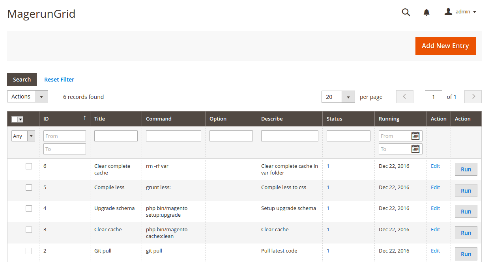
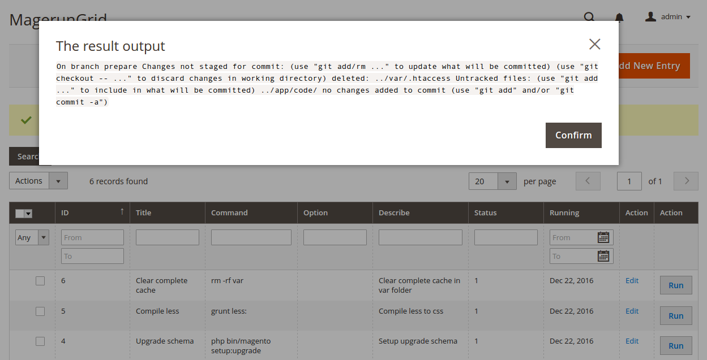
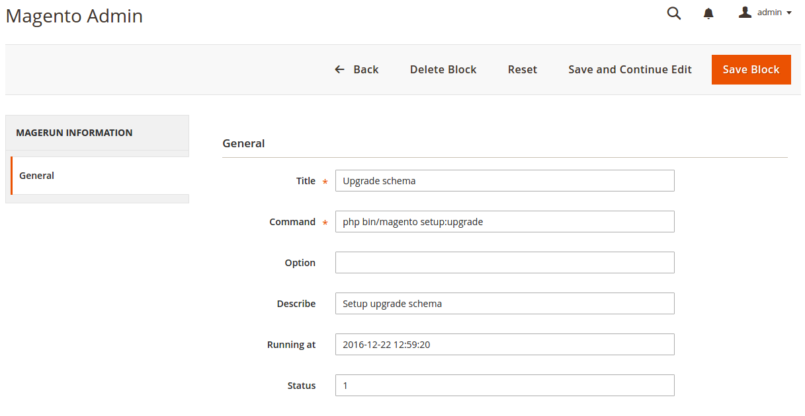

Smart Magerun administrator tool for Magento 2
============================

The Smart Magerun tool to help you execute shell command CLI directly in Admin alternative do that via SSH.

Making the deploying more convenient with Magento 2 site.



## Feature

* Execute shell command CLI directly in Admin

## Installation with Composer

* Open terminal
* Navigation to your project
* Ensure to clear cache before run these commands below:
 
```
composer require ducdh/magerun
php bin/magento setup:upgrade
php bin/magento setup:static-content:deploy
```
## Installation without Composer

* Download the module from github: https://github.com/dhduc/SmartMagerun/archive/master.zip
* Extract archive and copy all directories to app/code/
* Go to project home directory and execute these commands

```
php bin/magento module:enable Smart_Magerun
php bin/magento setup:upgrade
php bin/magento setup:static-content:deploy
```
## Usage

To execute command go to System --> Magerun --> Task


Click to **Run** button in the row of command that you want to exec, wait a moment until command excute successful.
And the result:



To add new or edit command, click to **New** button or **Edit** link.



## Copyright

[Open Source License](LICENSE.txt)
